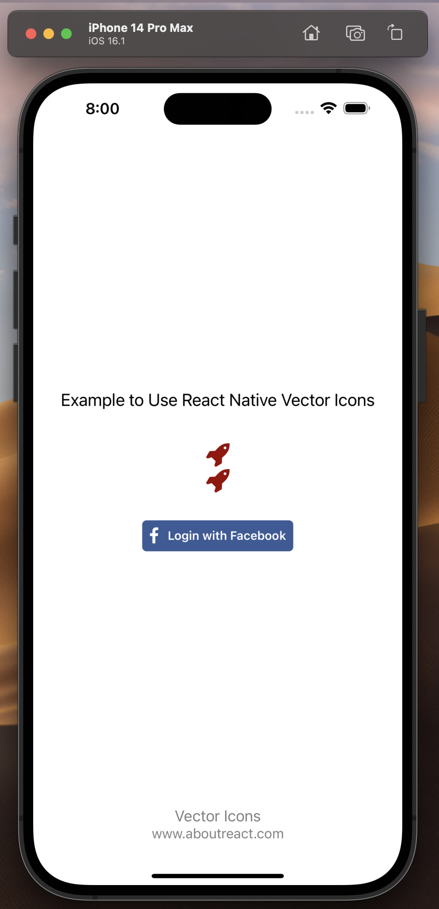
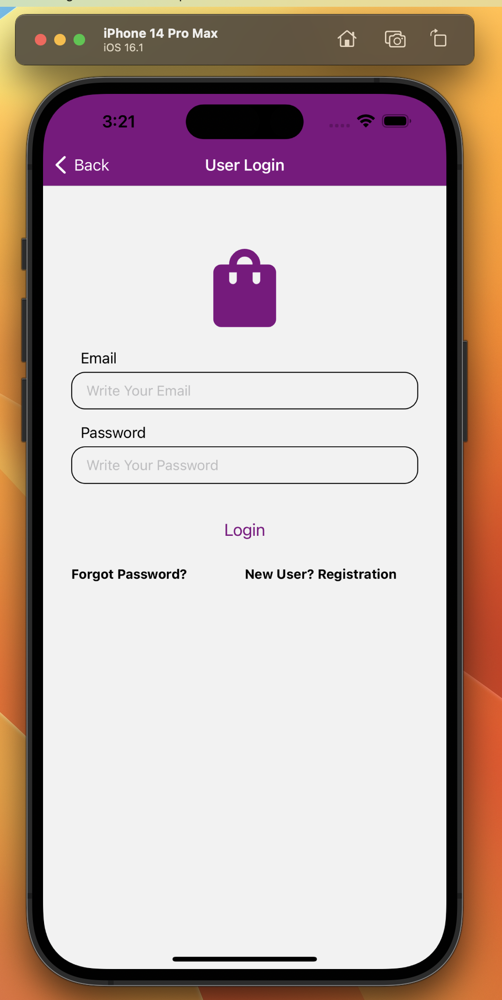
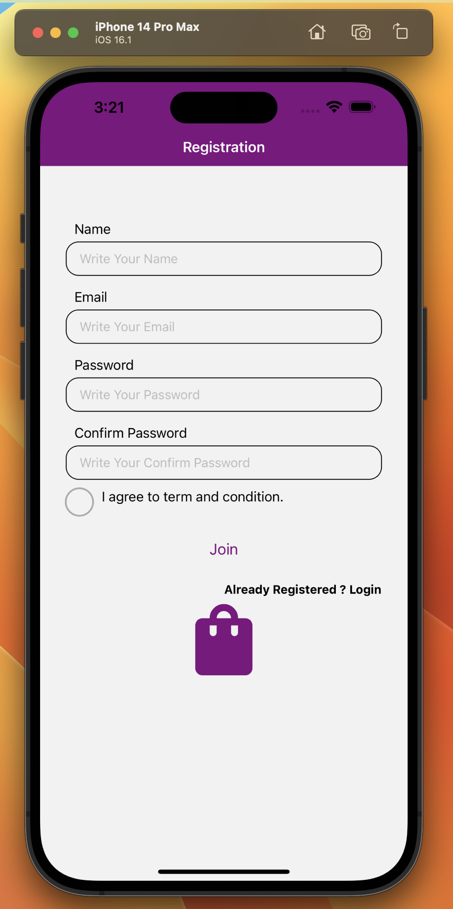
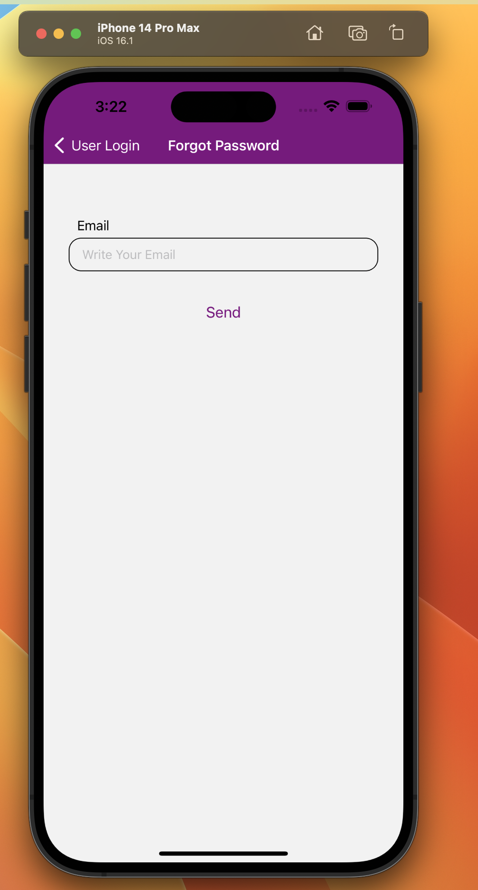
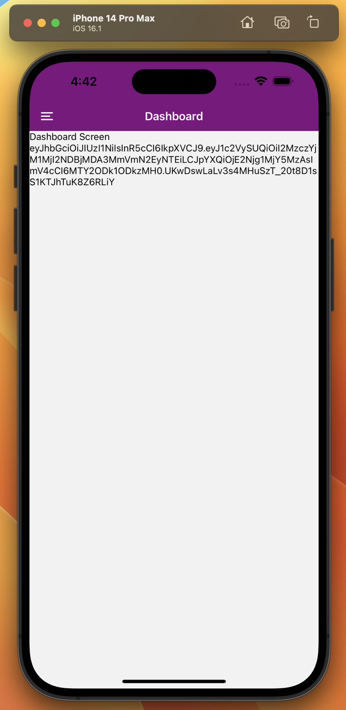
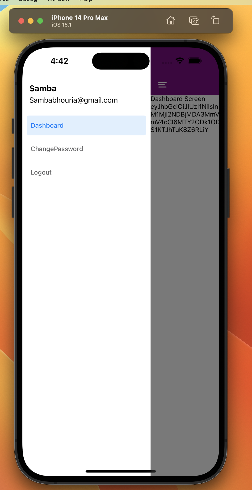

# React Native and Express Node JS Complete Authentication

Authentication using React Native and Express Node JS
#  Topics

    1. Redux Toolkit
    2. Toolkit Configuration
    3. Registration
    4. Login
    5. JWT Token
    6. Async Storage
    7. Get Logged User Data
    8. Logout
    9. Send Password Reset Email
    10. Change Password
    11. edux State Management

# `screenShot`

