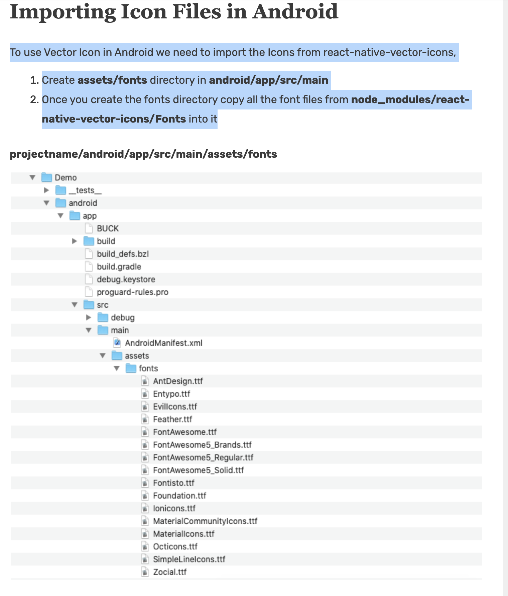
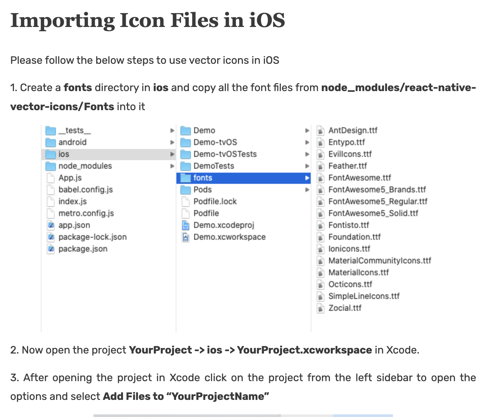
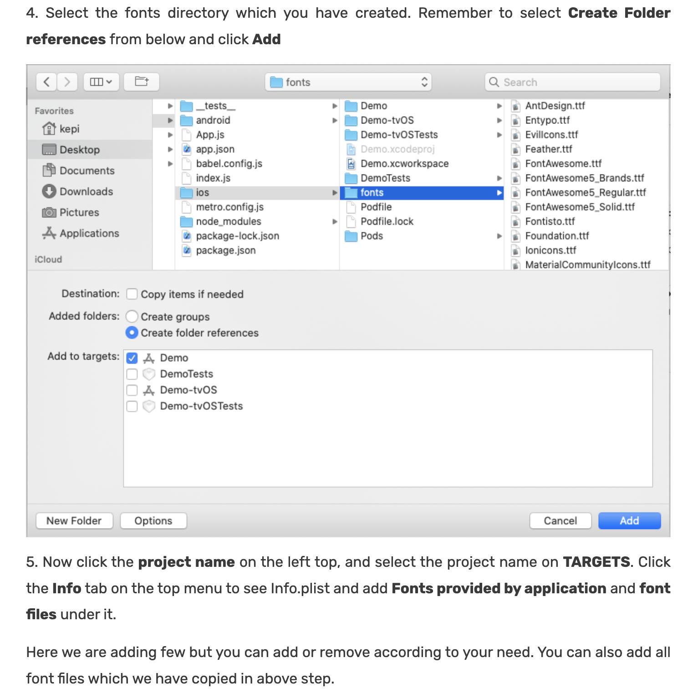
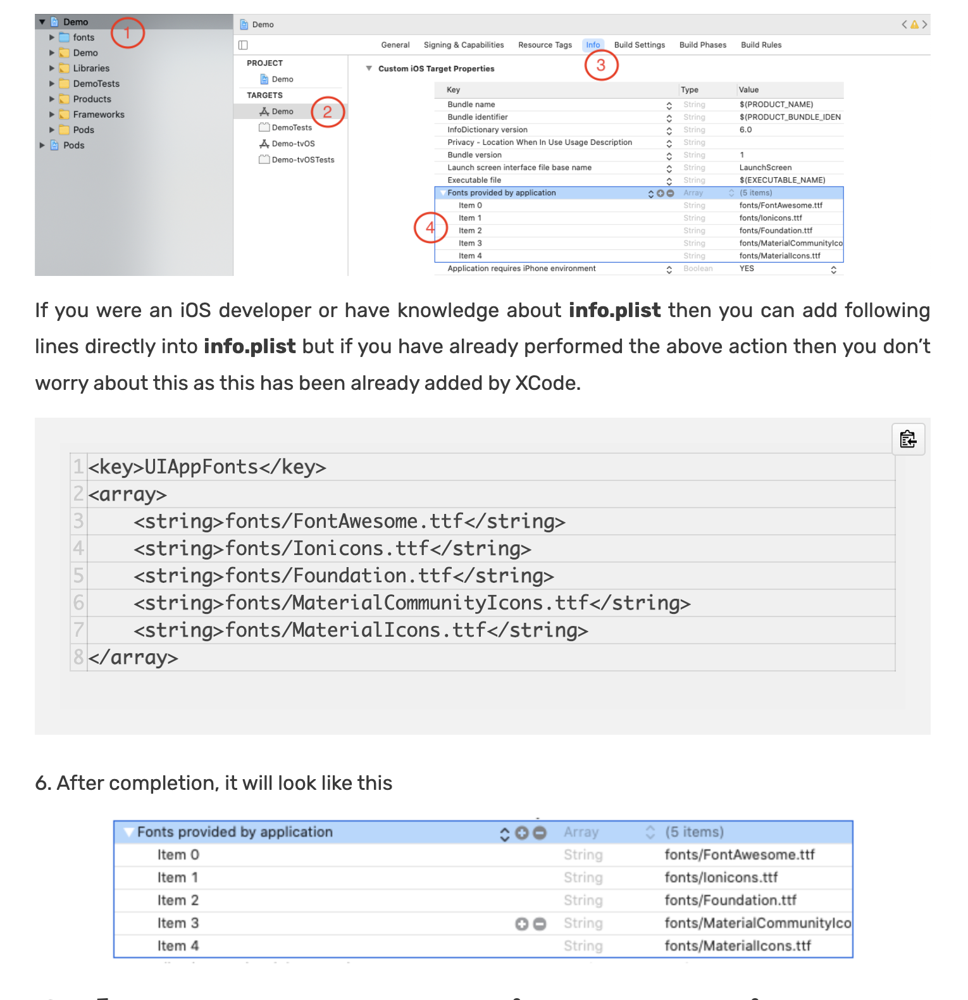

# Vector Icons

React Native Vector Icons are very popular icons in React Native. In this post, we will see Example to Use Vector Icons in React Native using react-native-vector-icons. Vector Icons are perfect for buttons, logos and nav/tab bars. Vector Icons are easy to extend, style and integrate into your project.

#  How to use Vector Icons in React Native?

To use Vector Icons you have to follow the below steps:

Create a new React Native project
Install the Dependency (react-native-vector-icons)
Install CocoaPods
Importing Icon Files in Android
Importing Icon Files in iOS
Lastly, Import icon component in your project and start using it

#  Importing Icon Files in Android

To use Vector Icon in Android we need to import the Icons from react-native-vector-icons,

Create assets/fonts directory in android/app/src/main
Once you create the fonts directory copy all the font files from node_modules/react-native-vector-icons/Fonts into it

# Importing Icon Files in iOS

Please follow the below steps to use vector icons in iOS

1. Create a fonts directory in ios and copy all the font files from node_modules/react-native-vector-icons/Fonts into it

# `screenShot`

